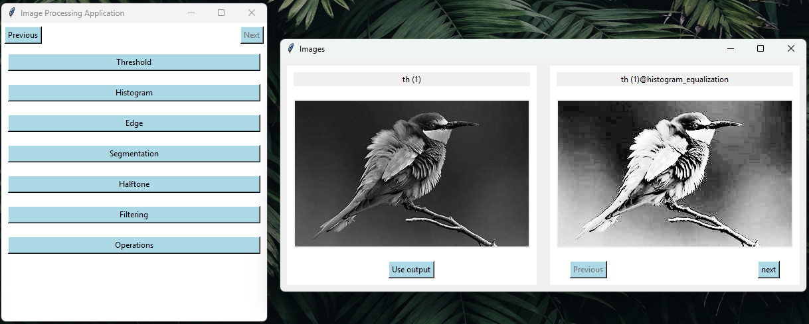
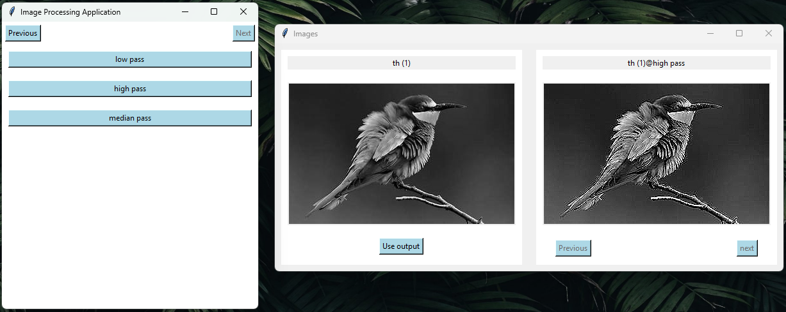

# Image Processing 

## Overview

This project is a desktop application that contains a variety of image processing techniques implemented from scratch using Python.

## Features
- Histogram Equalization

- Halftone
  - simple
  - advanced (error diffusion)

- Edge Detection
  - Simple Techniques 
    - sobel
    - prewitt
    -  kirsch compass masks
  - Advanced Techniques
    - homogeneity operator
    - difference operator
    - difference of gaussians (DOG)
    - contrast-based 
    - variance
    - range

- Filtering
    - high-pass
    - low-pass
    - median

- Image Operations
    - addition
    - subtraction
    - inversion
    
- Histogram Based Segmentaion
    - manual
    - peak
    - valley
    - adaptive histogram

## Demo




## Installation (how to use ?)
- 1- create a conda environment with python version 3.10 
```bash
 conda create --name image_processing python=3.10
```
- 2- activate this environment
```bash
 conad activate image_processing
```
- 3- install some packages 
```bash
 conda install -c conda-forge matplotlib numpy opencv scipy pillow
```
- 4- use this command to run the project (make sure the camera is open)
```bash
 python gui.py
```
